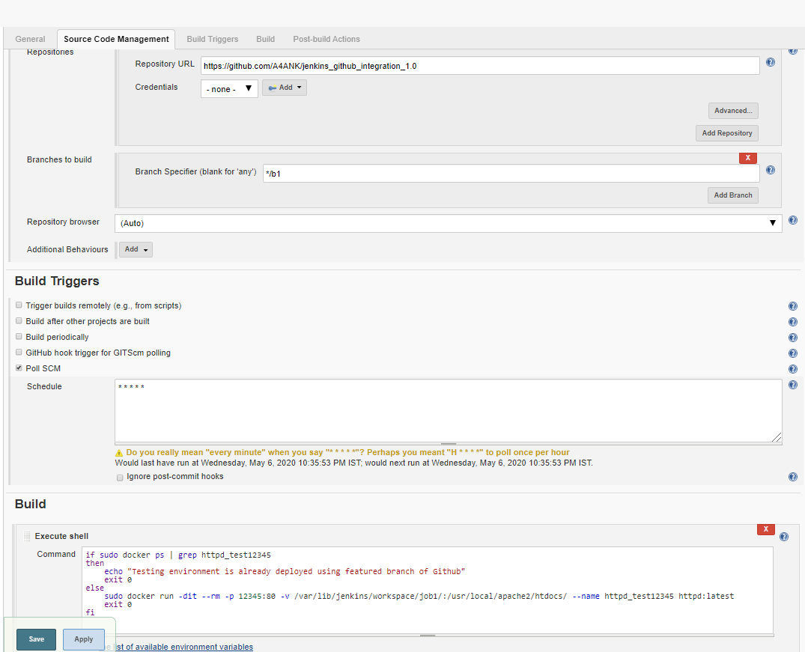
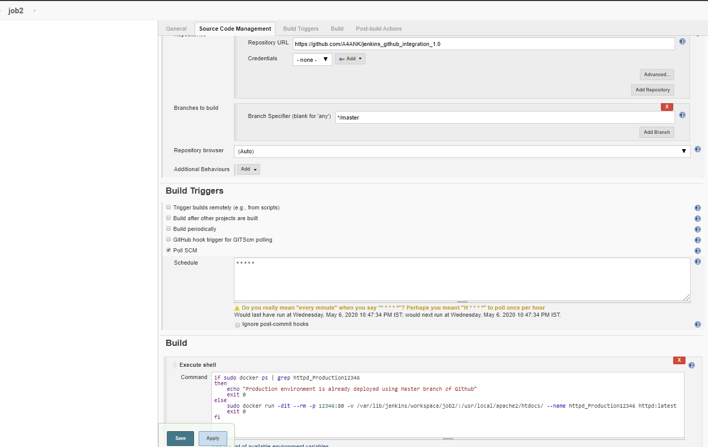
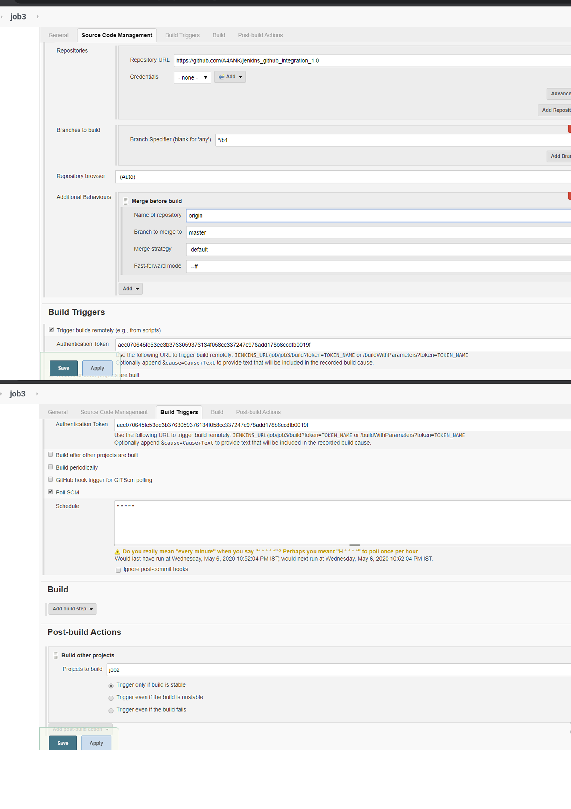

# Jenkins and Github Integration using PollSCM, Job Chaining and Remote Triggers, git hooks.

## Integrating Jenkins with local git hooks and deploying the source code on docker containers using PollSCM triggers.

Three jobs are needed for simulating this project.

###### 1. job1
For deploying testing environment on the top of docker using git hooks(post-commit) 
when any commits are done from the featured branch( other than master(main branch)) and
the job is scheduled using PollSCM.

git hooks => post-commit  script
vi .git/hooks/post-commit
    #!/bin/bash
    echo "First <git fetch> and then Post Commit Tasks are started"                                                     
    git fetch                                                                                                              
    git push                                                                                                                
    echo "git push is done to the current Remote Branch"                                                                   
    #echo "remote Build Trigger using jenkins URL"                                                                          
    #curl --user "<user>:<password>" <Remote Build Trigger URL> 

###### 2. job2
For deploying Production environment only when there is some change in master branch and scheduled using PollSCM.

###### 3. job3

For merging featured branch to the master(main) branch and triggered remotely using http://<jenkins url>/job/job3/build?token=TOKEN with credentials of jenkins users only and it also trigger job2 if it is build(run) successfully.
It is also scheduled using PollSCM.

